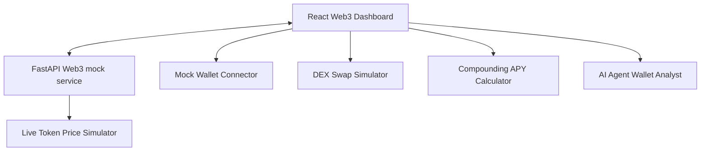

# Aether.fi - Web3 Portfolio Analytics & dApp Platform

A sleek, high-fidelity portfolio tracking, DEX swap simulator, yield optimization playground, and conversational AI wallet advisor built with FastAPI and React.

---

## 🚀 Key Features

* **Real-time Portfolio Tracker**: Live simulated token prices (ETH, SOL, LINK, UNI) with price tickers, allocation metrics, and historical net worth trends.
* **DEX Swap Simulator**: Custom swap widget with slippage tolerance configurations, live gas price calculation, and mock transaction executions.
* **DeFi Yield Staking playground**: Dynamic compound interest calculator driven by interactive sliders for principal amount, APY %, and duration.
* **NFT Collectibles Gallery**: Premium grid of digital collectibles with zoom-on-hover card animations and rarity tags.
* **Aether AI Analyst Oracle**: Real-time AI wallet analyst chatbot assisting users with gas optimization, yield opportunities, and risk assessment.
* **Ethereum Gas Index**: Live system gas congestion indicator.

---

## 🛠️ Architecture



* **Frontend**: React + TypeScript + Vite + custom Vanilla CSS (supporting glassmorphism and animations) + Recharts + Lucide icons.
* **Backend**: FastAPI (Python 3) serving simulated Web3 JSON feeds and compiled static assets.

---

## ⚡ Quickstart

### Prerequisite

Make sure you have **Node.js** and **Python 3** installed on your system.

### 1. Build Frontend Static Assets
```bash
cd frontend
npm install
npm run build
cd ..
```

### 2. Run FastAPI Backend
```bash
# Setup Python virtual environment
python -m venv .venv
source .venv/bin/activate  # On Windows: .venv\Scripts\activate

# Install dependencies
pip install -r backend/requirements.txt

# Start Server
uvicorn app.main:app --app-dir backend --port 8000 --reload
```

Open **[http://localhost:8000](http://localhost:8000)** in your browser to view the live dashboard!

---

## 📜 License
MIT License. Created by [957908](https://github.com/957908).
