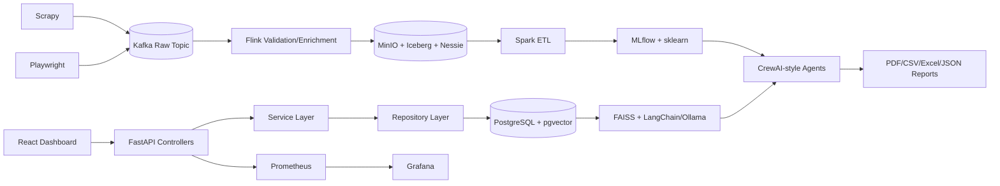
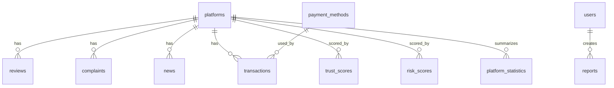
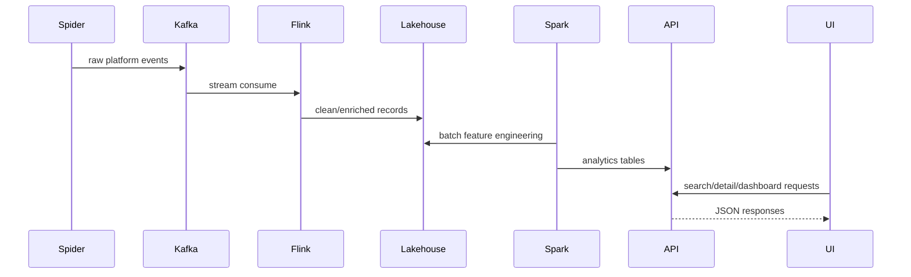
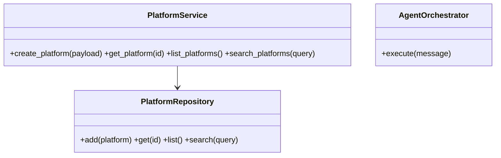
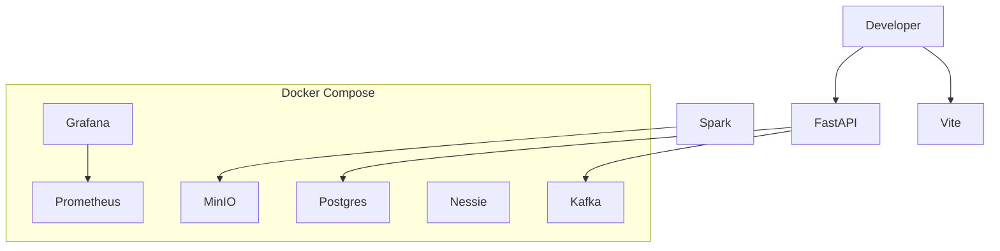

# Multi-Agent AI Data Lakehouse Platform for Betting Site Data Intelligence

Production-oriented clean architecture scaffold for collecting, streaming, storing, analyzing, and explaining betting platform intelligence.

## Architecture Review

The repository was effectively empty except for Git metadata and `.gitkeep`, so this implementation establishes the missing product baseline while preserving the current branch history. The architecture separates frontend, backend, data collection, streaming, lakehouse, Spark, ML, RAG, agents, monitoring, infrastructure, tests, and documentation.

## Missing Features Report

All requested PDF modules were absent in the starting tree: FastAPI, React/Vite/TypeScript, PostgreSQL schema, Scrapy, Playwright, Kafka, Flink, MinIO/Iceberg/Nessie compose services, Spark, ML, FAISS, RAG, CrewAI-style orchestration, dashboards, reports, monitoring, deployment, and tests.

## Improvement Plan

1. Replace in-memory repositories with async SQLAlchemy repositories.
2. Add Alembic migrations and seeded reference data.
3. Wire Kafka/Flink/Spark jobs to object storage bronze/silver/gold tables.
4. Add authenticated dashboard workflows and role-based API guards.
5. Train, register, and deploy MLflow models.
6. Harden scraper compliance with per-site allowlists, robots checks, and rate profiles.

## Technical Debt Report

This milestone intentionally creates thin but working boundaries for every subsystem. Remaining debt is integration depth: production credentials, real source adapters, Alembic revision history, browser E2E tests, and deployed observability dashboards.

## Folder Structure

```text
backend/          FastAPI, domain, services, repositories, schemas, database schema
frontend/         React TypeScript Vite dashboard shell
 data_collection/ Scrapy spiders and Playwright dynamic collector
streaming/        Kafka topic constants and Flink job boundary
lakehouse/        MinIO/Iceberg/Nessie integration area
spark/            PySpark batch job area
ml/               Scikit-learn pipelines and MLflow registry area
rag/              Sentence Transformers + FAISS semantic retrieval
agents/           Async multi-agent orchestration
monitoring/       Prometheus/Grafana config
infra/            Deployment and Docker extension area
docs/             Architecture diagrams and guides
tests/            Unit and API tests
```

## Architecture Diagram



## ER Diagram



## Sequence Diagram



## Class Diagram



## Deployment Diagram



## Development

```bash
python -m venv .venv
source .venv/bin/activate
pip install -r requirements.txt
uvicorn backend.app.main:app --reload
docker compose up -d postgres kafka minio nessie prometheus grafana
```

## मराठी Project Comments

या codebase मधील प्रत्येक मुख्य module मध्ये मराठी टिप्पणी जोडली आहे. त्या comments मध्ये त्या file चे काम, architecture मधील भूमिका आणि पुढील production implementation साठी extension point स्पष्ट केले आहे. संपूर्ण मराठी project explanation `docs/marathi-project-explanation.md` मध्ये उपलब्ध आहे.

## Run the Live Application

The repository now includes a runnable local live application with a FastAPI backend, React dashboard, PostgreSQL/pgvector, Kafka, MinIO, Nessie, Prometheus and Grafana services.

```bash
cp .env.example .env
docker compose up --build
```

Open these URLs after the containers are healthy:

- Frontend dashboard: http://localhost:5173
- Backend health: http://localhost:8000/health
- Backend OpenAPI docs: http://localhost:8000/docs
- Grafana: http://localhost:3000
- Prometheus: http://localhost:9090
- MinIO console: http://localhost:9001

For local non-Docker API development:

```bash
python -m venv .venv
source .venv/bin/activate
pip install -r backend/requirements.txt
uvicorn app.main:app --reload --app-dir backend
```
